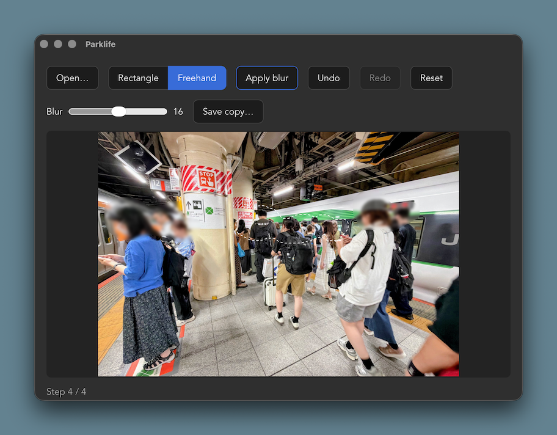

# Parklife

A macOS desktop app for blurring regions of an image and saving the result as a new file.

Open an image, mark one or more regions, apply blur, and save a copy. Blur runs in Rust
(the `image` crate), so large images stay responsive.



## Features

- **Open** via file dialog or by dropping an image onto the window.
- **Rectangle** or **Freehand** (lasso) region selection — drag across the image to mark an area.
- **Adjustable blur strength** (Gaussian sigma 1–30).
- **Apply blur** repeatedly to stack regions; **Undo / Redo / Reset** step through the history.
- **Save copy…** writes a JPEG; the original file is never touched.
- HEIC/HEIF input is supported (transcoded to PNG via the macOS built-in `sips`).

## Stack

- [Tauri](https://tauri.app) 2.11.5 (Rust backend)
- React 19 + TypeScript + Vite 7 (frontend)
- pnpm

## Prerequisites

- Rust toolchain (`rustup`)
- Node.js + pnpm
- macOS with Xcode command line tools

## Development

```sh
pnpm install
pnpm tauri dev      # run the app
```

Other commands:

```sh
pnpm build          # frontend build only (tsc + vite)
pnpm tauri build    # production bundle (native arch only)

# Universal binary — runs on both Apple Silicon and Intel Macs:
rustup target add aarch64-apple-darwin x86_64-apple-darwin
pnpm tauri build --target universal-apple-darwin
# .app lands in src-tauri/target/universal-apple-darwin/release/bundle/macos/

cd src-tauri
cargo test          # Rust tests
cargo clippy
```

See [CLAUDE.md](./CLAUDE.md) for architecture notes and repo-specific setup details.
